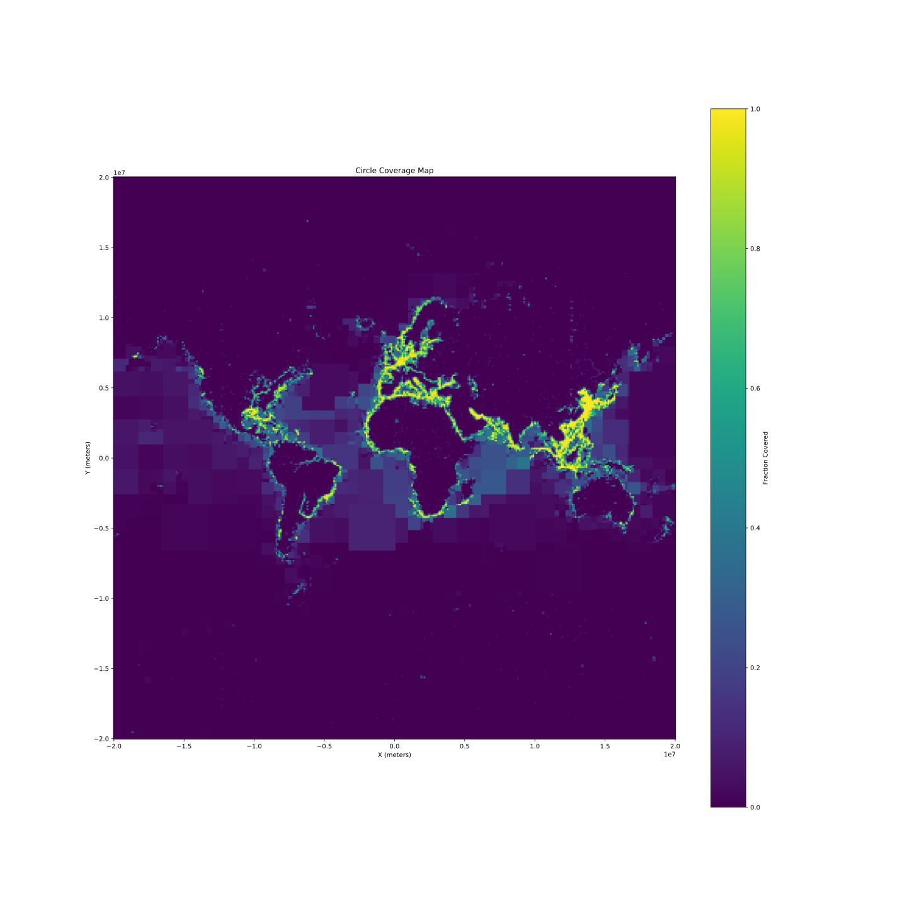
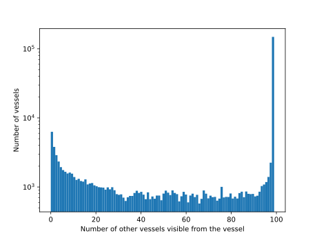
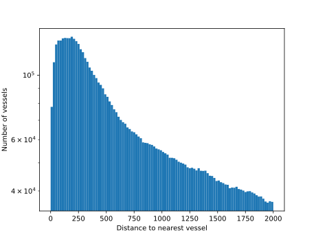

# Ocean surface visible from ships

We estimate the fraction of ocean coverage visible from the on-board radar systems of vessels. This shows the maximum coverage we could achieve, where all vessels to adopt our crowd sourcing system.

The above map of ocean surface visible by the on-board radar of some vessel and histograms are produced by the code in [this notebook](CoverageMap.ipynb). The following outlines the methodology used as well as caveats and limitations.

## Methodology

* A single day of data is used
* A single position, the first one, of each ship is used
* The horizon as seen from each vessel is calculated from its height (air draft)
  * The air draft is estimated from vessel beam length and vessel type
  * If the vessel has no reported length in AIS type 5 messages, a length of `10m` is assumed
* The fraction of the sea inside an area covered by such horizon-circles around ships is calculated
* If an area has a `covered fraction > 0.4`, it is subdivided into four smaller areas, and their fraction calculated, recursively until an area of `60NM * 60NM` is reached
  * Areas covering land are also subdivided, no matter their coverage fraction

## Error sources
The map is approximative. Sources of error:

* Low density areas have a high random variation due to the short timespan
* Air draft is only an estimation
* Some vessels have no reported length
* First sighting of a ship in the AIS feed is not the same time for all ships

## Caveats

* This estimate the radio horizon, which is slightly larger than the horizon for visible light (`2.1*sqrt(height)` vs `1.8*sqrt(height)`)
* This does NOT estimate whether two ships would see each other, but whether a ship can see an object at sea level
  * Two taller objects can see each other if `2.1*sqrt(height(a)) + 2.1*sqrt(height(b)) > ditance(a, b)`

## Possible improvements

* Stacking multiple images from different days would allow for a higher resolution even in low density areas (that is splitting already at a lower fraction than .4)
