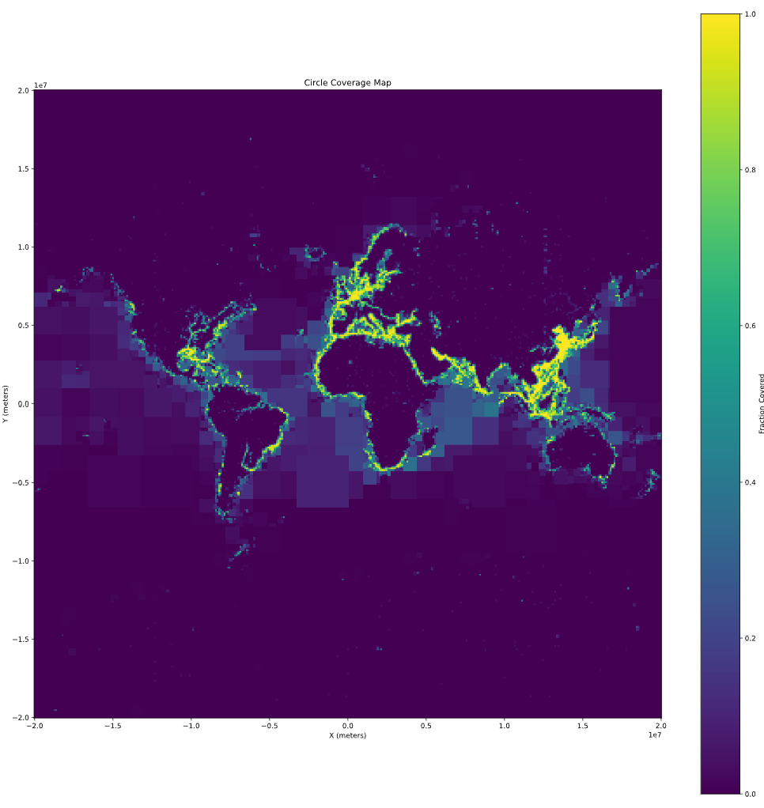
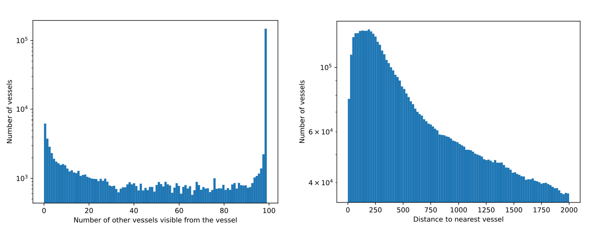

# Ocean surface visibility from ships

This analysis estimates the fraction of ocean surface visible to vessels' onboard radar systems, illustrating potential coverage if all vessels adopt our crowdsourcing system.

The map and histograms below are generated by the code in [this notebook](CoverageMap.ipynb). Below is an outline of the methodology, along with associated caveats and limitations.

## Methodology

* **Data selection**: Utilized a single day's AIS data, considering only the initial position of each ship.
* **Horizon calculation**: Determined each vessel's horizon based on its air draft, estimated from vessel beam length and type. For vessels lacking reported length in AIS type 5 messages, a default length of 10 meters was assumed.
* **Coverage calculation**: Computed the fraction of the sea within the horizon circles around ships. Areas with a coverage fraction greater than 0.4 were subdivided into four smaller areas, recursively, until reaching a size of 60 nautical miles by 60 nautical miles. Areas encompassing land were also subdivided, regardless of coverage fraction.

## Error sources

**Data limitations**: The use of a single day's data and initial ship positions may not represent typical vessel movements.
**Assumptions in air draft**: Estimations based on vessel type and beam length may introduce inaccuracies.
**Simplified calculations**: The methodology does not account for factors like radar range limitations, environmental conditions, or obstructions affecting radar visibility.

## Caveats

The estimate represents the radio horizon, which is slightly greater than the visual horizon:
    **Radio horizon**: 2.1 * sqrt(height)
    **Visual horizon**: 1.8 * sqrt(height)

The model estimates whether a ship can detect an object at **sea level**, not whether **two ships can see each other**.

    Two taller objects can detect each other if:
         2.1 * sqrt(height(a)) + 2.1 * sqrt(height(b)) > distance(a, b)

## Possible improvements

* **Stacking data from multiple days** could enhance resolution, especially in low-density areas. This would enable earlier subdivision at lower coverage fractions (below 0.4), providing more granular insights.
